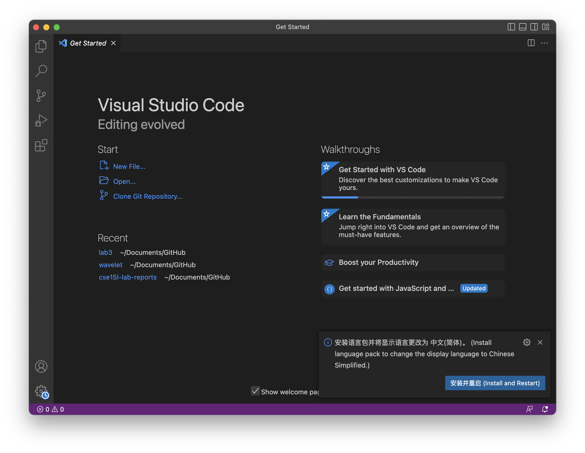
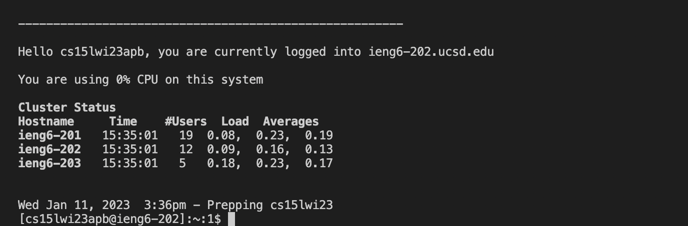
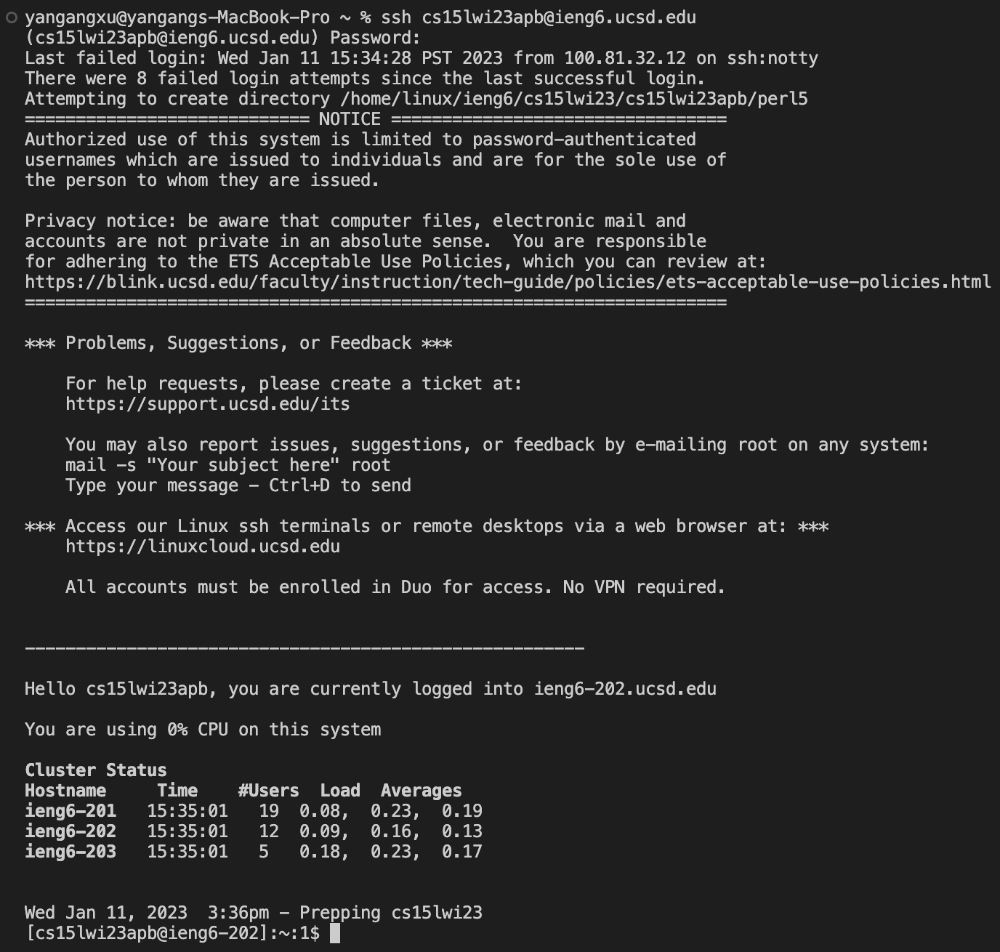
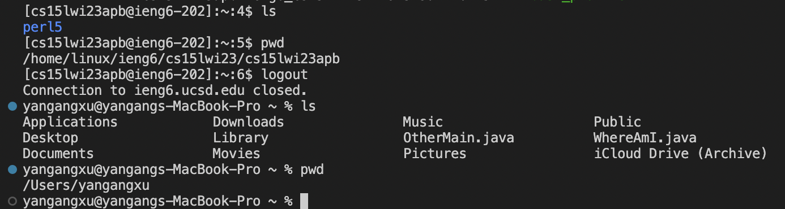

# Week 1 Lab Report

## Installing VScode

First step, intalle the Visual Studio Code from the weibsite, "https://code.visualstudio.com/". When you open the webiste, there are three different version of Visual Studio Code, macOS, Windows x64 and Linus 64, choose the one same as your labtop or computer. When you installed it, you can open it and see the window that looks like the picture above. Then, you can click the terminal botton which is on top of your screen to open a new terminal and run some command. You also can you control + shift + ` to open a new terminal.

## Remotely Connecting

## Trying Some Commands

