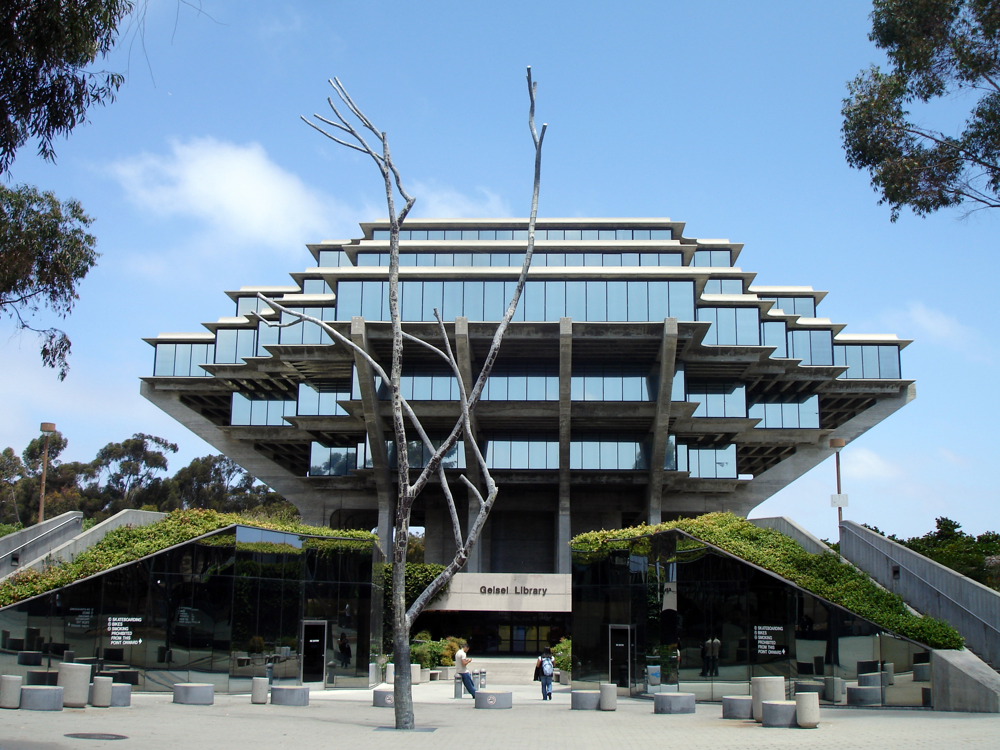

*Hello, World!*

**Hello, World!**

# Hello, World!

## Hello, World!

[Link](https://www.youtube.com/)




* one
* two
* three

1. one
2. two
3. three

---

`Hellow, World!`

```
Hello, World!
Hello, World!
Hello, World!
```
