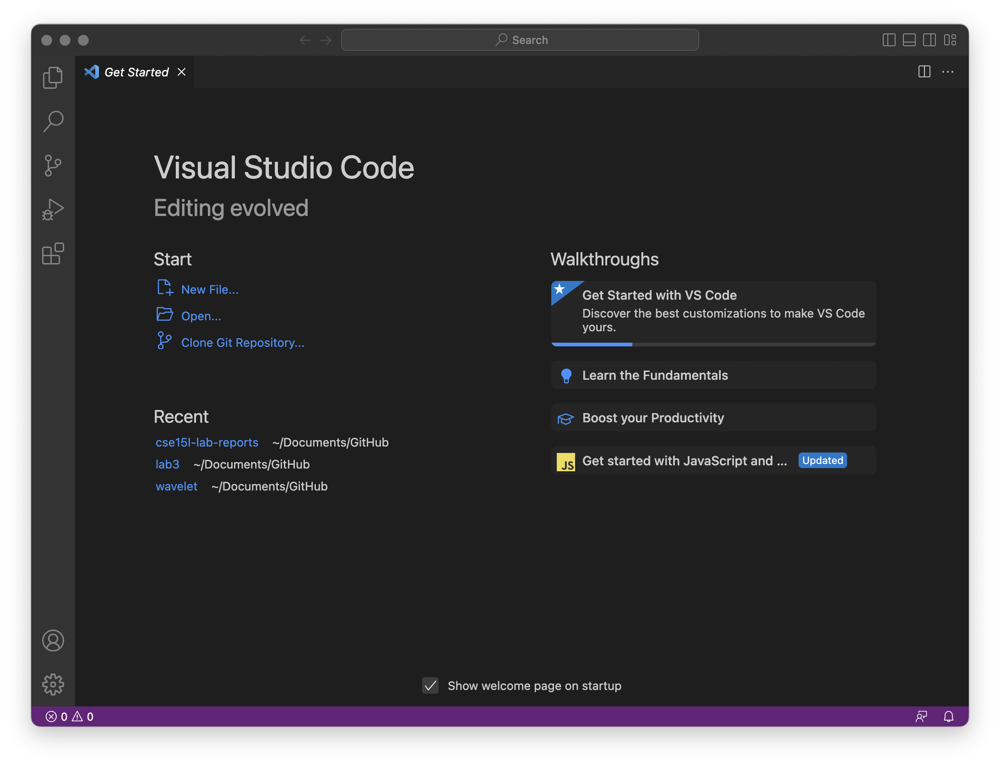
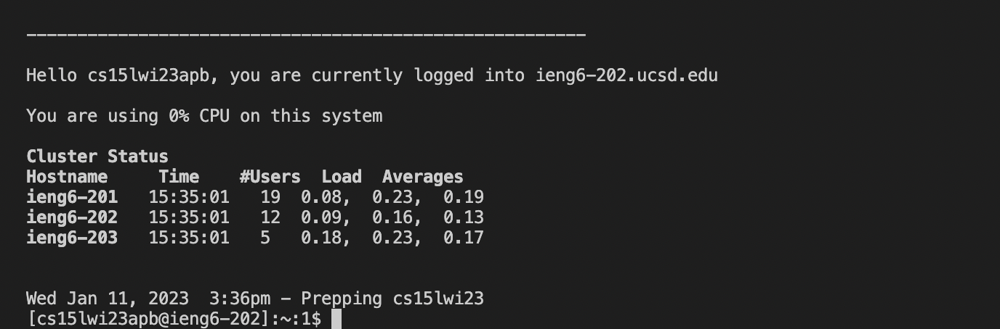
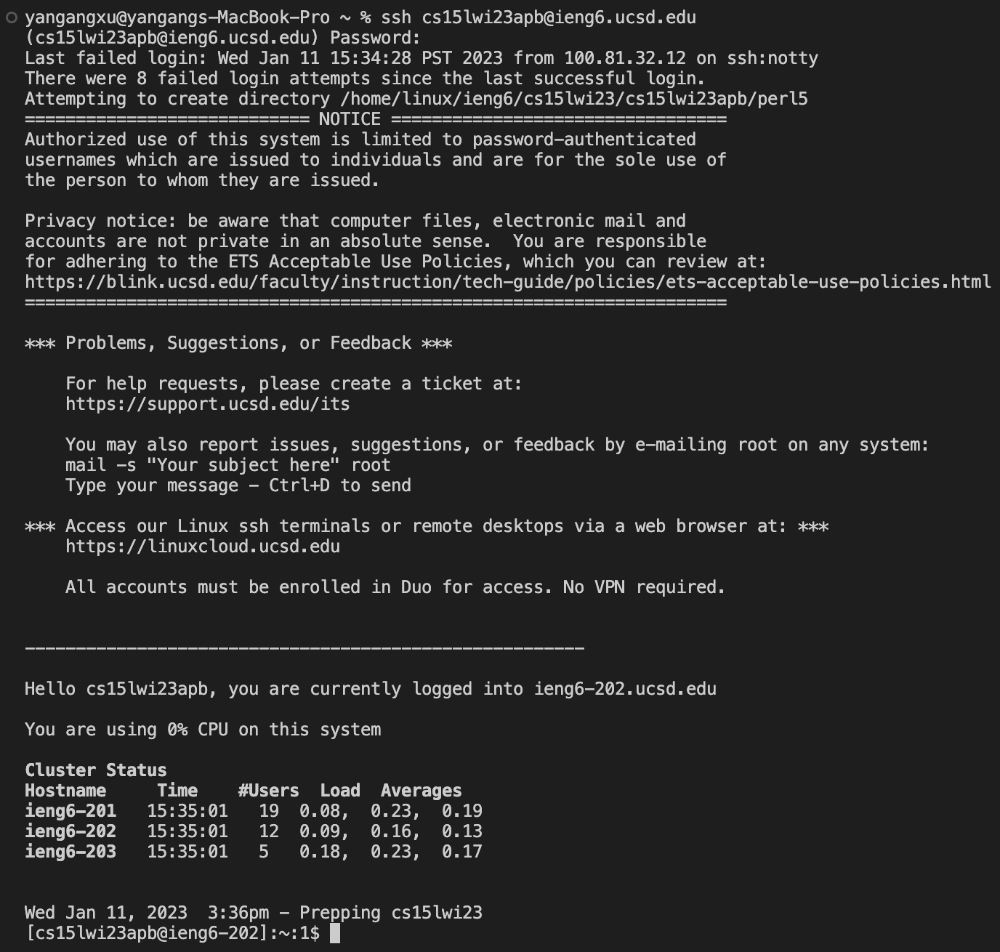
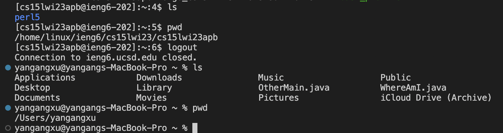

# CSE 15L Lab Report

## Lab Report 1

## Installing VScode

The first step is installing the Visual Studio Code from the website, "https://code.visualstudio.com/". When you open the website, there are three different versions of Visual Studio Code, macOS, Windows x64, and Linus 64. Choose the one that is the same as your laptop or computer. After you install it, you can open it and see the window that looks like the picture above. Then, you can click the terminal button from the menu option on top of your screen to open a new terminal and run some commands. You can also control + shift + ` to open a new terminal.

## Remotely Connecting

For remote connection, you have to check your account for CSE 15L from the website: "https://sdacs.ucsd.edu/~icc/index.php" then you have to reset your password. After you have rested your password successfully, you have to wait a few minutes. Open a terminal and use the ssh command to log in to your account. Your command should look like this, "ssh cs15lwi23zz@ieng6.ucsd.edu", but with your course-specific account. After you enter your account, hit return. Then, enter your password and hit the return key. You will log in successfully if your account and password both are correct. You can see the information for your account. It looks like the picture above.

## Trying Some Commands

You can use the terminal to run some commands both on your computer and the remote computer, like in the picture above. ls means list directory, pwd means print working directory. You can use Control + D or enter the command exit to log out of the remote server in your terminal. And also, you can try some other commands, like cd, mkdir. The command cd is used to change the directory. The command mkdir is used to make a new directory.
