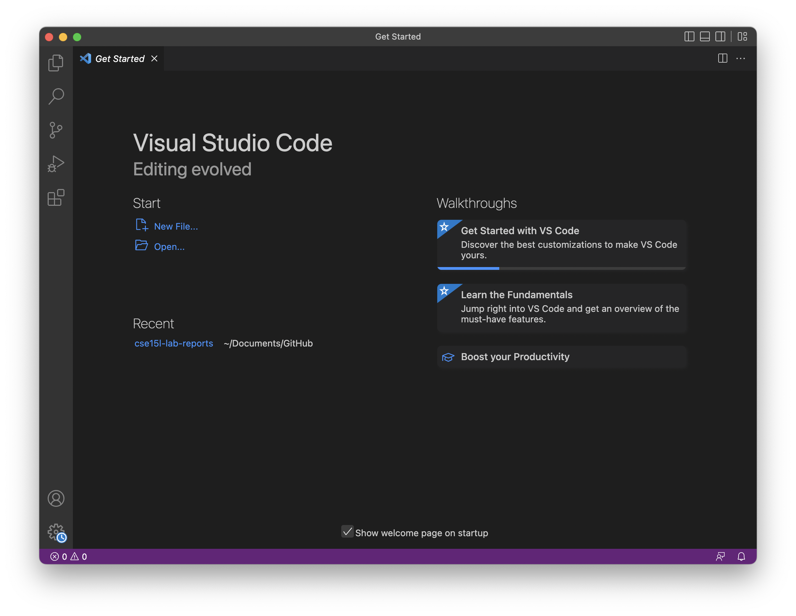
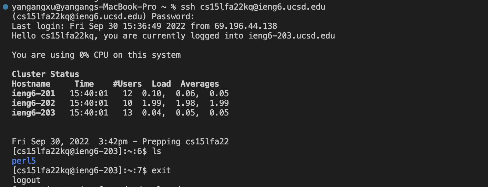
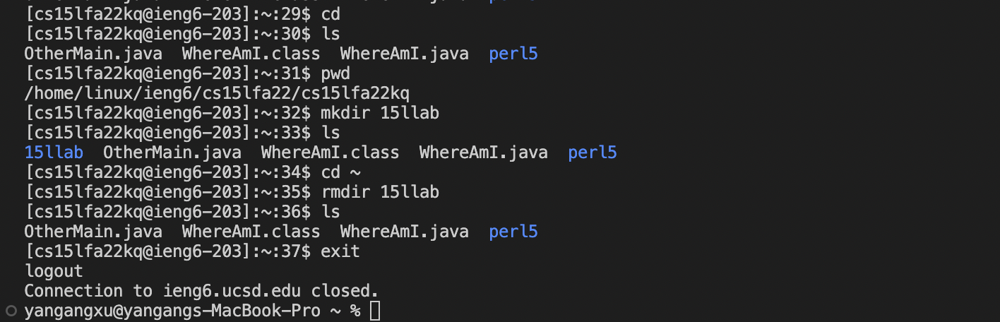
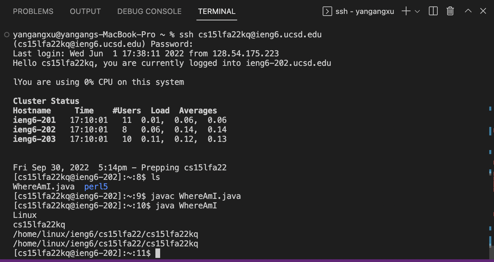
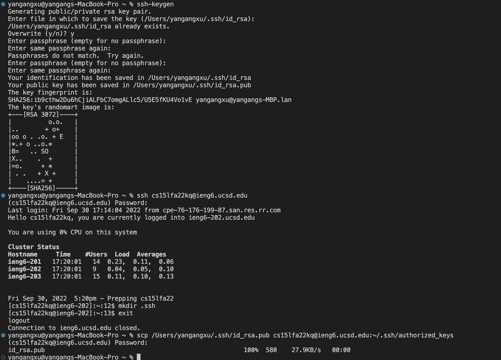
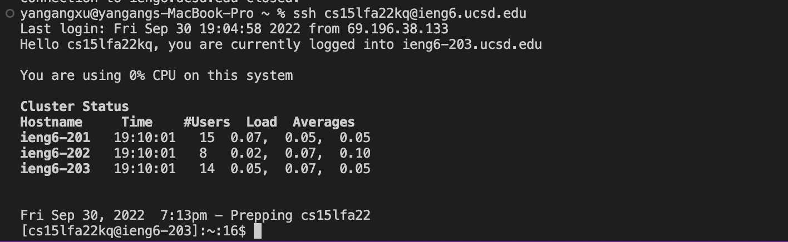
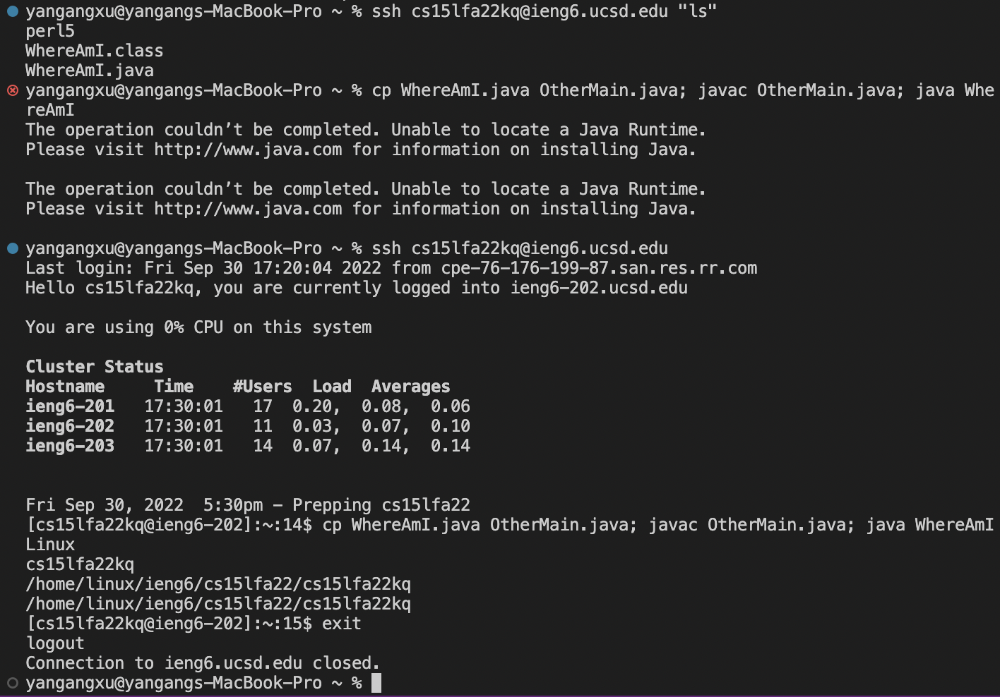

# Lab1-reports-week1

* ## Installing VScode
* ## Remotely Connecting
* ## Trying Some Commands
* ## Moving Files with scp
* ## Setting an SSH Key
* ## Optimizing Remote Running

## Part 1 – Meet Your Group!

* Name
* How you’d like people to refer to you (nickname, pronouns like he/her /they, etc)
* If you could be a kitchen appliance, what one would you be and why?

* Yangang Xu
* Computer science
* Pot

## Part 2 – Your CSE15L Account

## Part 3 – Visual Studio Code - 10 mins

## Write down in notes: 
**Everyone should share a screenshot of VScode open – help folks figure it out if it won’t install. If someone gets stuck, take a screenshot of the error message or point at which they are stuck so we can help them figure it out later, and they can decide to keep trying (potentially with the tutor helping) or move on.**

**The VScode is easy to download for me. I just followed the instructions, then I downloaded the VScode successfully.**

## Part 4 – Remotely Connecting - 15 mins

## Write down in notes
**When you’re done, discuss what you saw upon login. Take a screenshot or copy/paste the output. Did you all see the same thing? What might the differences mean? Note the results of your discussion in the notes document.**

**When I tried to login for the first time, I don’t know why It did not work for me. I tried to use my student account to login, it works. I tried to login using the course-specific account for CSE15L today, it worked for me today.**

## Part 5 – Run Some Commands

## Write down in notes:
**Copy at least one example from each group member, with an explanation, into your shared notes doc.**

**I run some commands on the mac, it works. I think I am not that familiar with it now, but after using those commands a few times, I will become familiar with them.**

## Part 6 – Moving Files over SSH with scp

## Write an answer in notes:

**What’s different about the output when you run this on the client vs. the server? What does this mean for what getProperty does?**

**I am unable to run the code on my mac because i did not download the Java on the mac, but it works on the remote computers. The getProperty used to show the system, account and the location.**

## Part 7 – SSH Keys

## Write down in notes:

**Repeat the timing experiment of editing and running WhereAmI.java now that you don’t have to use a password. How much time is saved per run?**

**It will save 30seconds per run, if I don’t have to type in the password.**

## Part 8 – Making Remote Running Even More Pleasant

## Write down in notes:

**First try using just what we learned in this lab, and document the best process you came up with. Try to get the total time for a run after editing and saving to under 10 total keystrokes/mouse clicks, including all typing. A “keystroke” is pressing one key on your keyboard. For example, pressing the up arrow counts as one keystroke, and typing “java” counts as 4.**

## Part 9 – Wrapup

**Discuss with your team – do you have any open questions about things you saw that you don’t understand? Write them down in your notes document or ask your tutor. Even if they don’t know, writing them down means we can come back to them later!**

**If you didn’t get everything to work, that’s OK! Keep trying and make sure your tutor knows if you’re totally stuck getting something set up; we’ll be posting some office hours soon where you can come to get unstuck as well.**

**Before you leave the lab, head to the assignment “Lab1 Participation” on Gradescope and complete it. It only has a couple of questions and is not going to take more than 2 minutes. This assignment will be used to award you participation credit for this lab. Please note that you will be receiving full credit for participation only if you have attended the lab in-person and actively engaged in discussions with your group.**

