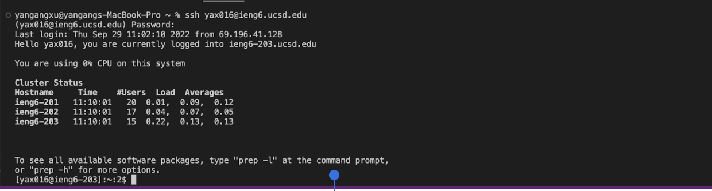
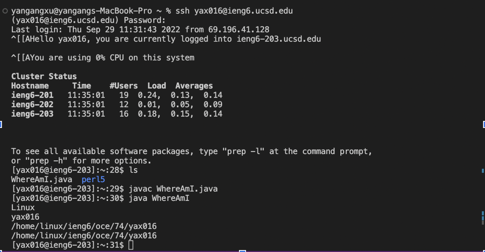

# Lab1-reports-week1

* ## Installing VScode
* ## Remotely Connecting
* ## Trying Some Commands
* ## Moving Files with scp
* ## Setting an SSH Key
* ## Optimizing Remote Running

## Part 1 – Meet Your Group!

* Name
* How you’d like people to refer to you (nickname, pronouns like he/her /they, etc)
* If you could be a kitchen appliance, what one would you be and why?

* Yangang Xu
* Computer science
* Pot
* My favorite place you’ve found on campus so far is the game room. I go there two or three times a week. I usally play games and study there with my frinds.

## Part 2 – Your CSE15L Account

## Part 3 – Visual Studio Code - 10 mins

## Write down in notes: 
**Everyone should share a screenshot of VScode open – help folks figure it out if it won’t install. If someone gets stuck, take a screenshot of the error message or point at which they are stuck so we can help them figure it out later, and they can decide to keep trying (potentially with the tutor helping) or move on.**

**I go the the Visual Studio Code website, then There is a button on the left, it shows download mac universal, Becuase My laptop is mac, so I choose the macOS version to download. After I download it into my labtop, I follow the instruction to install it on my labtop. Then it works for me. The picture above is when I open my VScode.**

## Part 4 – Remotely Connecting - 15 mins

## Write down in notes

**I looked my account and changed the password, but I still unable to log in to the reomte server. After I tried many times, I try to use my student account to log in, and it works.  I use the my student account in the lab time, but after the lab time, I try my CSE 15l account, it work, then i use my cse 15l account did the lab one more time.**

## Part 5 – Run Some Commands

## Write down in notes:
**Copy at least one example from each group member, with an explanation, into your shared notes doc.**

**I run some commands on the mac, it works. I think I am not that familiar with it now, but after using those commands a few times, I will become familiar with them. I tried to use command cd to change the directory, use ls to list file and folder, use mkdir to make a new directory and use pwd to print current directory**

## Part 6 – Moving Files over SSH with scp

## Write an answer in notes:

**I can't run the code on my mac because I did not download the Java on the mac, but it works on remote computers. The getProperty is used to show the system, account, and location. We use the command scp to move the file from our computer to the sever. after we move the file into the server, I can use ls to show all the file in the server, if we want to run it, we have to compile is first, then we can run it. we use the same comand to compile and run it on the server.**

## Part 7 – SSH Keys

## Write down in notes:

**we can use ssh-keygen to creat a file, it called pubilc key and private hey, those key will store in our computer or the server, we can use mkdir to make a new directory to store the key, the directory has to be with .ssh. after that, the command ssh can use it in palce of the password. it will be much easier for us, beacuse we don't have to type the pasword all time.**

## Part 8 – Making Remote Running Even More Pleasant

## Write down in notes:

**In the picture, we can type two commands at once, but for the command ls we have to use dougble quotation mark, then we can see all directory that we have on the remote server.and wo also can run  multiple commands on the same line, but i have to add semicolon between each command. if we run multiple commands on the same line, we can run more than one commands once, it will easier for us.** 
